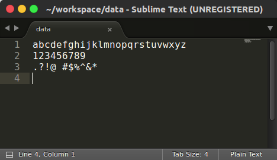
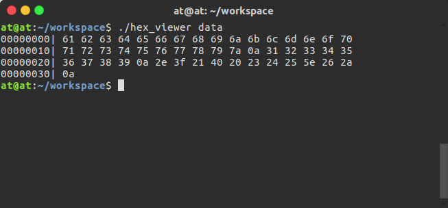

# Task 1 #
`Release: 2016-09-02`

---
##实现一个基于命令行的十六进制文件查看器（hex_viewer）##
* 具体功能为对 __任意文件__ 以 __十六进制__ 的方式进行查看，并显示在控制台(console)上。
* 每行显示 __十六个字节__ 的内容，并且在每行的开头需要显示的 __当前行首字节__ 位置（_base-0,
start from 0, width 8_），每个字节以一个空格隔开，行末允许有空格。
* 如果命令行输入参数有误，则显示具体参数用法 ``Usage: ./hex_viewer [file]``；如果读取文件失败，
则显示``Cannot open the file <file>.``。（&lt;file&gt;为具体文件路径）

---
## Sample ##
* Data Content:  

	

* Output Sample:  

	

---
##  Reference ##
* https://en.wikipedia.org/wiki/Hex_dump
* http://lxr.free-electrons.com/source/lib/hexdump.c

---
## Deadline ##
	 2016-09-03/15:00