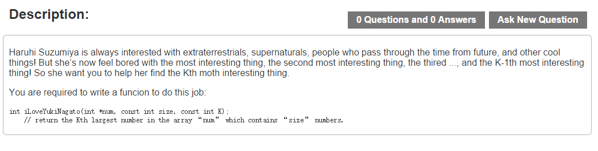

# Task 9 #
`2016-10-24/22:29`

## Part 1 - Find The Kth Largest Element ##
Read the image as below:

Finish it in C (make sure your code can be compiled by g++-4.8.2+), and
write a main.c to generate random data to test your code, recording the
time waste and output it on screen. (The efficiency of your code must be
better than my cpp code in the situation of the big-scale data testing.)

PS: The code-style and comments are as important as the code-efficiency.

Reference: https://en.wikipedia.org/wiki/Compatibility_of_C_and_C%2B%2B

## Part 2 - Decode the Base64 string ##
Use python2 to decode the base64 string 'TWlkdGVybSBFeGFtIEZpZ2h0aW5nIQ=='.
You do not need to hand in your code and the result.

Reference: 
* https://zh.wikipedia.org/wiki/Base64
* https://docs.python.org/2/library/base64.html
